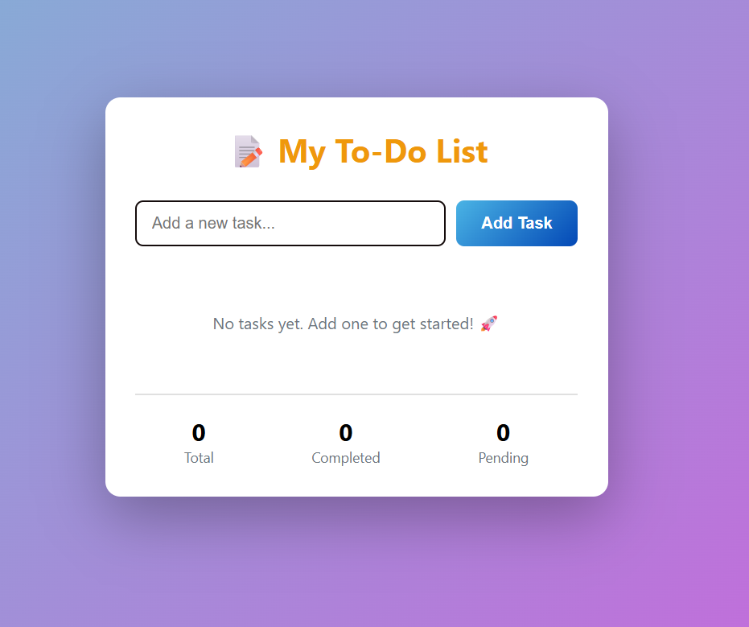

## Hi there 👋

# 📝 My To-Do List

A simple, clean, and responsive **To-Do List Web App** built using **HTML, CSS, and JavaScript**.  
It allows you to add, track, and manage your daily tasks with a beautiful and modern interface.

---

## 🚀 Features

✅ Add new tasks easily  
✅ Mark tasks as completed or pending  
✅ Delete tasks when finished  
✅ Task summary showing:
- **Total tasks**
- **Completed tasks**
- **Pending tasks**  
✅ Data persists in browser using **localStorage**  
✅ Responsive and mobile-friendly design

---

## 🛠️ Built With

- **HTML5** – structure of the app  
- **CSS3** – modern UI with gradient background and card styling  
- **JavaScript (ES6)** – logic for adding, updating, and deleting tasks  

---

## 📂 Project Structure
To-Do-List/
├── index.html
├── style.css
├── script.js
└── snapshot.png

---

## 🧠 How to Use

1. Open the app in your browser.  
2. Type a new task in the input field.  
3. Click **"Add Task"** to save it.  
4. Click on a task to mark it **completed** or **pending**.  
5. Click ❌ to **delete** any task.  
6. Your progress (total, completed, pending) updates automatically.

---

## 🌐 Live Demo

🔗 **View it online:** [https://saipawan2003-28.github.io/SAIPAWAN2003-28/](https://saipawan2003-28.github.io/SAIPAWAN2003-28/)  

---

## 📸 Screenshot

Below is a preview of the app’s interface 👇  

---

## 💡 Future Enhancements

- Add due dates and reminders  
- Add categories or priorities  
- Enable dark/light mode toggle  
- Sync data using Firebase or an API  

---

## 🧑‍💻 Author

**Your Name**  
📧 [Sai Pawan.pawansai688@gmail.com](mailto:pawansai688@gmail.com)  
🌐 [GitHub Profile](https://github.com/SAIPAWAN2003-28)

---

⭐ *If you like this project, give it a star on GitHub!* ⭐

